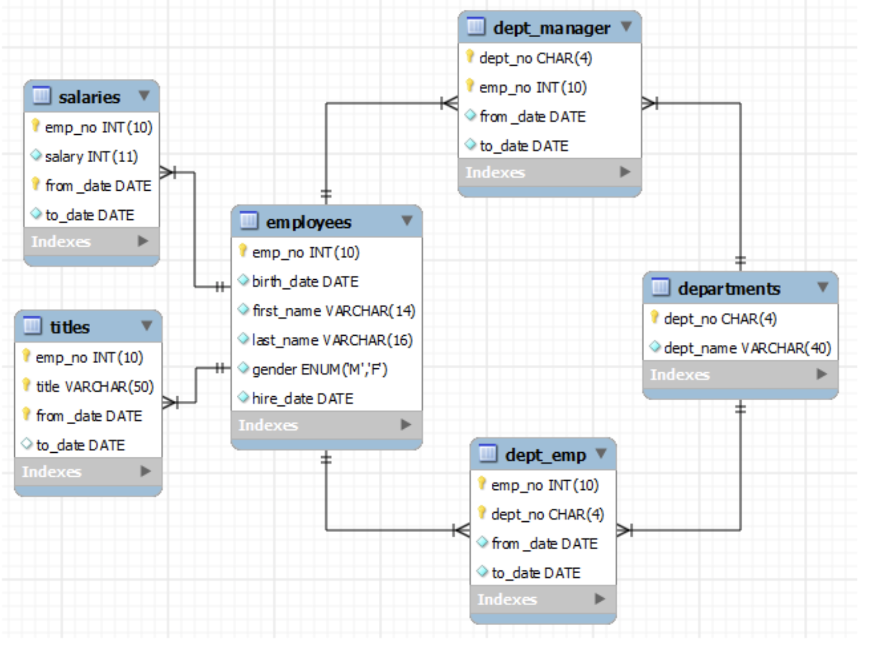

# Lab 6

For this lab you will be using ro_employees database again and will be applying more of the recently acquired SQL querying capabilities to retrieve data. 

The ER diagram of the Employees database is given below.



### Task 6.1: Selecting from multiple tables:

***Question:*** Create a list of all employees who started on 03/01/2000 showing their name, gender and job title. Hint: You will find it useful to rename your tables to a single letter. 

```


```


***Question:*** Create a list of all employees who started on 03/02/1998 showing their name, gender, job title and employee id.  

```


```


***Question:*** Create a list of all employees who started on 03/02/1998 showing their name, gender and job title and employee id who are still working at the company. 


```


```


***Question:*** Find out the name and job title of employee number 10038. 

```


```


***Question:*** Why only two rows?

```


```

***Question:*** Create a single query that finds the names and original job tiles for the following employees: 10030, 10031, 10037 and 10038. Hint1: use the in clause in the where condition. 

```


```
