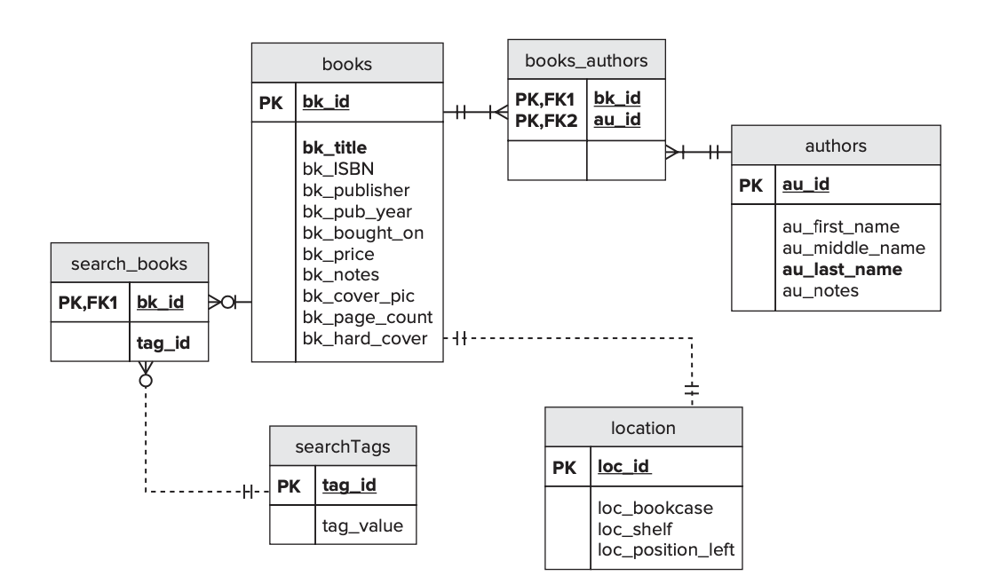

# Lab 9

## Setup for Lab:

This lab uses the following ER model and the relational model associated with it is provided in the lab9.sql. You can execute the SQL file using your workbench and create the necessary tables.



## The story of the joins:

### Inner Join:
It combines data from several tables, and returns a subset where the data overlaps. 


Let us say e.g. in our relational model, if we want to find which books are located in which shelf and book case (from location) then we can use the inner join to get the data for us. Books 
Try this:
```
SELECT bk_title BookName, loc_shelf Shelf, loc_position_left Position, loc_bookcase BookCase
	FROM books
		INNER JOIN location
			ON location.fk_bk_loc=books.bk_id;
```
**Remember, if the ON condition (equijoin) is not provided, then it would return the result of a cartesian product.**

***Question:*** Use inner join query to retrieve all the books that has got the keyword "engineering" (lowercase) tagged. Hint: you need to use books, search_books,  and searchTags for your join i.e. books ⋈ search_books ⋈ searchTags.

```

```
### Left Outer Join:
Left outer join is used when we want to see the full list of things that interest us on the LEFT, along with any additional features that some items on the list may have on the RIGHT side. 

Let us insert a new book:
```
INSERT INTO books (bk_id, bk_title) VALUES (13,'Database Illuminated') 
```

In this case we have added a new book but haven't placed it in any particular shelf at the moment. While trying to retrieve the list of books (as we did above in the inner join) and the shelf they have been placed on, in this case, we need to return the new book too but we might not have the location of the shelf. To retrieve the same, we use the LEFT OUTER JOIN. The syntax is the same as that of the INNER JOIN except that you replace the keyword INNER JOIN with LEFT OUTER JOIN.

***Question:*** Write the query to retrieve all the books that may or may not be allocated to a shelf. Books ⟕ Location

```


```

### Right Outer Join:
Right outer join is the mirror image of the left outer join. 

The syntax remains the same except that we need to replace the keyword LEFT with RIGHT. 

***Question:*** How would you change the query written above (for the left outer join) to provide the same outcome but using a right outer join. 

```


```

MySQL 5.7 does not have a FULL OUTER JOIN but the same effect can be created using the UNION of the results of LEFT OUTER JOIN and RIGHT OUTER JOIN.

### Natural Join:
Natural join is used when the tables have similar column names upon which they can be joined automatically. In other words, you do not have to specify the ON clause as you have done for the inner and outer joins. 

***Question:***  What does the following SQL query return and why does it have multiple rows for a some of the books? This is equivalent to > books ⨝ books_authors ⨝ authors

```
SELECT b.bk_title, b.bk_publisher, a.au_first_name, a.au_last_name  FROM books b 
		NATURAL JOIN books_authors ba NATURAL JOIN authors a;

```
```


```


### Self Join:
Sometimes we might be want to join a table onto itself to retrieve some data. In such cases, using aliases to name the table(s) becomes necessary. In our example, let us assume that we want to find the list of all the books that were published in the same year in the order in which they were added to the database.
The following query is executed. 
```
SELECT a.bk_id, a.bk_title, a.bk_published_year, b.bk_id, b.bk_title, b.bk_published_year
	FROM books a 
		JOIN books b 
			ON a.bk_published_year=b.bk_published_year; 
```
This query returns the following list:
| | | | | | | |
| --- | --- | --- | --- |  --- | ---  | --- |
| 1	| SQL Bible |	2008	| 1	| SQL Bible |	2008 |
| 2	 |Wiley Pathways: Introduction to Database Management |	2007| 	2	| Wiley Pathways: Introduction to Database Management |	2007 |
| 3	 |Microsoft SQL Server 2000 Weekend Crash Course	| 2001	| 3	| Microsoft SQL Server 2000 Weekend Crash Course |	2001 |
| 4	| SQL Functions: Programmers Reference |	2005	| 4	 |SQL Functions: Programmers Reference	| 2005 |
| 5	| A La Recherche du Temps Perdu	2002 |	5	 | A La Recherche du Temps Perdu| 	2002 |
| 12	| Steppenwolf	| 2002	| 5	| A La Recherche du Temps Perdu |	2002 |
| 6	| After the Gold Rush: Creating a True Profession of Software Engineering	| 1999	| 6	| After the Gold Rush: Creating a True Profession of Software Engineering	| 1999| 
| 7	| Letters From Earth	| 2010 |	7	| Letters From Earth |	2010 |
| 11 |	A Short History of Nearly Everything |	2010 |	7	| Letters From Earth	| 2010 |
| 8	| Mindswap| 2006	| 8	| Mindswap	| 2006 |
| 9	| Stranger in a Strange Land |	1991	| 9	| Stranger in a Strange Land	| 1991 |
| 10 | Jonathan Livingston Seagull	| 1972 | 10 |	Jonathan Livingston Seagull |	1972 |
| 7 |	Letters From Earth	| 2010	| 11	| A Short History of Nearly Everything |	2010 |
| 11 | A Short History of Nearly Everything	| 2010 |	11 |	A Short History of Nearly Everything	| 2010 |
| 5 |	A La Recherche du Temps Perdu	 |2002	 |12|	Steppenwolf	| 2002 |
| 12	| Steppenwolf |	2002	| 12	 |Steppenwolf| 	2002 |

***Question:***  But the only result we are interested in is the rows marked in bold as the rest of the result are redundant data. How can we modify the query to achieve the expected result of just 2 rows?

```


```


